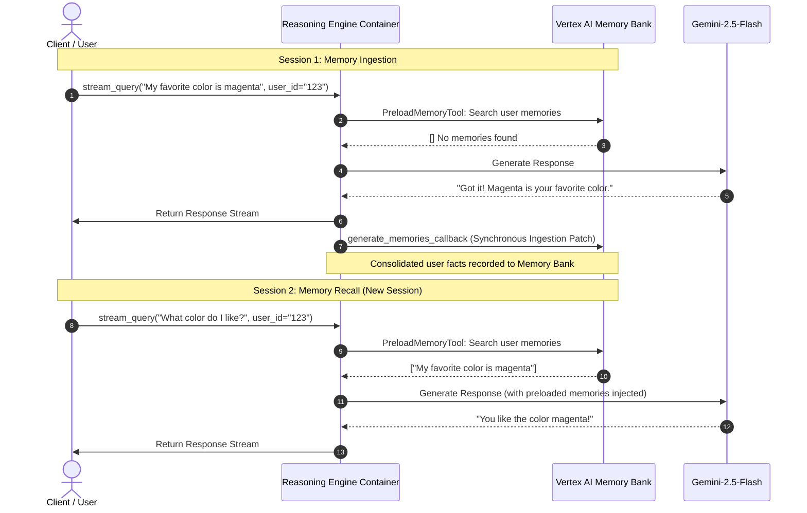

# Stateful ADK Agent with Vertex AI Memory Bank

An end-to-end implementation of an Agent Development Kit (ADK) search agent that maintains long-term user memories and continuity across distinct conversational sessions using the **Vertex AI Memory Bank** and **Reasoning Engine** platform.

---

## 1. Overview

This project demonstrates a stateful AI agent capable of remembering facts across independent, distinct sessions for the same user. It integrates:
*   **Google Search Tool**: To answer general questions from the web when fresh information is needed.
*   **Vertex AI Memory Bank**: A centralized long-term semantic indexing memory system that stores user facts, preferences, and conversational history.
*   **ADK Memory Services**: Automatic memory lookup and consolidation hooks running inside the Vertex AI Reasoning Engine container.

---

## 2. Stateful Architecture & Lifecycle

The agent utilizes a two-stage stateful lifecycle to ensure user facts are remembered across sessions:



### Preload Memory Tool
Prior to executing the core model call, the `PreloadMemoryTool` retrieves historical facts associated with the current `user_id` from the Vertex AI Memory Bank and injects them into the model's instruction context. 

### Memory Consolidation Callback
Upon completion of the conversation step, `after_agent_callback` triggers the `generate_memories_callback` function. This extracts fresh facts from the recent dialogue and updates the Memory Bank.

```python
# app/agent.py
async def generate_memories_callback(callback_context: CallbackContext):
    """Callback triggered after agent run to extract and consolidate memories."""
    # Process and extract memories from the session history
    await callback_context.add_session_to_memory()
    return None
```

### ⚠️ Critical Gotcha: Cloud Run CPU Throttling Patch
*   **The Problem**: The Reasoning Engine container is hosted on Google Cloud Run. Immediately after the final byte of the client response stream is delivered, Cloud Run throttles the container CPU to near-zero to optimize execution costs. Because the standard ADK schedules `add_session_to_memory` as a background fire-and-forget task (`asyncio.create_task()`), the container is throttled before the task can make its network call to Vertex AI.
*   **The Solution**: We monkeypatch the internal memory bank service to synchronously block and `await` the `ingest_events` API request inside the request lifecycle. This guarantees the facts are successfully transmitted before the response completes and CPU is throttled.

```python
# app/agent_runtime_app.py
async def patched_ingest(self, *, app_name, user_id, events_to_process, custom_metadata=None):
    # ... Build ingestion payloads ...
    # Force synchronous await on the deployed container runtime
    await api_client.agent_engines.memories.ingest_events(**request_kwargs)

vms.VertexAiMemoryBankService._add_events_to_memory_via_ingest = patched_ingest
```

---

## 3. Resource Provisioning & Configuration

### Agent Platform Memory Bank
Vertex AI Agent Engine automatically provisions and links a centralized **Memory Bank** per Reasoning Engine deployment. The Memory Bank indexes, extracts, and processes ingested conversation logs asynchronously. 
*   **Consolidation Latency**: Memory bank ingestion triggers asynchronous Long-Running Operations (LRO) to consolidate facts. Allow **45 seconds** of latency between sessions for new facts to become searchable.

### IAM Roles & Policies
To successfully deploy the agent and run memory bank features, configure the following IAM permissions:

#### 1. Developer / Deployment Identity
The user or Service Account executing the deployment (`agents-cli deploy`) requires:
*   **Vertex AI Administrator** (`roles/aiplatform.admin`) or **Vertex AI User** (`roles/aiplatform.user`)
*   **Service Account User** (`roles/iam.serviceAccountUser`) on the Reasoning Engine runtime service account.

#### 2. Reasoning Engine Runtime Service Account
The container executes under the identity of the Vertex AI Reasoning Engine Service Account (typically `service-<PROJECT_NUMBER>@gcp-sa-aiplatform-re.iam.gserviceaccount.com`). It requires:
*   **Vertex AI Service Agent** (`roles/aiplatform.serviceAgent`)
*   **Vertex AI User** (`roles/aiplatform.user`) — to access the Memory Bank APIs (`aiplatform.memories.*`) and Session Services (`aiplatform.reasoningEngines.*`).

---

## 4. Installation & Deployment

### Pre-requisites
1.  Install `uv` Python package manager:
    ```bash
    curl -LsSf https://astral.sh/uv/install.sh | sh
    ```
2.  Install the Google Agents CLI:
    ```bash
    uv tool install google-agents-cli
    ```
3.  Set up your Google Cloud SDK and log in:
    ```bash
    gcloud auth login
    gcloud auth application-default login
    gcloud config set project genaillentsearch
    ```

### Deploying to Vertex AI Agent Engine
Run the deployment command from the project root. The CLI automatically bundles the code and compiles it in the cloud:

```bash
agents-cli deploy --region us-central1 --no-confirm-project
```

Once deployment completes, note the generated **Agent Runtime ID** (e.g., `projects/884152252139/locations/us-central1/reasoningEngines/7895861829652447232`).

---

## 5. Testing Guide

### Local Testing (`test_local.py`)
A complete local test runner that performs cross-session validation by calling local runners but storing data directly to your live Vertex AI Memory Bank:

```bash
.venv/bin/python test_local.py
```
*   *Note: The local test runner includes its own loop patch to prevent the thread from closing prior to the local ingestion request finishing.*

### Local Playground (`agents-cli playground`)
To test the agent interactively in a local web interface with hot-reloading:

```bash
agents-cli playground
```

### Remote Hosted Testing (`test_deployed.py`)
To verify the fully live container on Vertex AI, execute the remote validation script. It dynamically provisions sessions, sends Session 1 facts, sleeps for 45 seconds for platform consolidation, and verifies Session 2 memory recall:

```bash
.venv/bin/python test_deployed.py
```

#### Expected Output:
```
Creating remote sessions for user test-user-6d0aa118...
Created sessions: 8002722883719659520, 682121689428918272

--- Start Deployed Session 1 (User: test-user-6d0aa118, Session: 8002722883719659520) ---
Query 1: Hello! My favorite color is magenta and I live in Paris. What is my favorite color?
Deployed Agent Response 1: Your favorite color is magenta.

--- Waiting 45 seconds for remote Memory Bank consolidation... ---

--- Start Deployed Session 2 (User: test-user-6d0aa118, Session: 682121689428918272) ---
Query 2: Hi there! What color do I like and where do I live? Do not search the web.
Deployed Agent Response 2: Hi there! You like the color magenta and you live in Paris.
```
